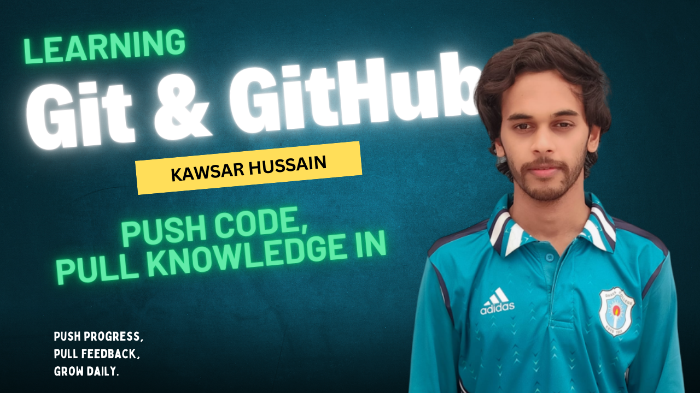

## Hello, I'm Kawsar Hussain

- **Introduction:** Welcome! I'm currently exploring Git and GitHub to improve my version control skills and understand collaborative development. This journey includes learning about commits, branches, merges, and pull requests—building a strong foundation for managing real-world projects with confidence.

- **Skills:**
    1. html
    2. css
    3. bootstrap 
    4. JavaScript

```````html
<!DOCTYPE html>
<html lang="en">
<head>
    <meta charset="UTF-8">
    <meta name="viewport" content="width=device-width, initial-scale=1.0">
    <title>html</title>
</head>
<body>
    <h2> This is a basic structure of html </h2>
</body>
</html>

```````

- **Projects:** Now I'm developing a portfolio website. 

- **Education:** I'm a BSS Honours student in the _Department of Sociology_ at Dhaka College, affiliated with the University of Dhaka. Here is an overview of my education.

| Class Name | School or University Name | Department | Passing Year | 
|-------------|---------------|------------|----------|
| BSS Honours | Dhaka College | Sociology | Appeared | 
|HSC | BBC Degree College | Humanities | 2019 |
|SSC | Bachamara High School | Science | 2017 |


- **Contact Information:** 

    Email: <a href="mailto:mailto:someone@example.com"> mailtokawsarhussain@gmail.com</a> 
    
    Phone: <a href="tell:+8801716-000000">01716-000000</a>

##
Programming teaches problem-solving; Git and GitHub teach how to build and grow with others
##